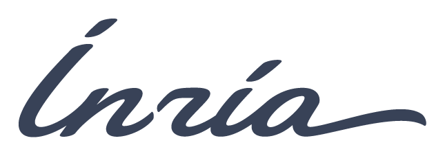
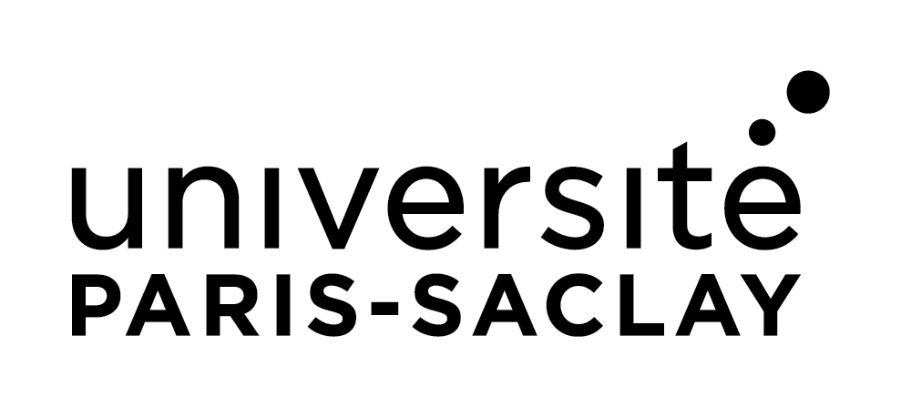

<p align="center">
  
</p>

<h3 align="center">Deep Learning on Symmetric Positive Definite Matrices</h3>

<p align="center">
  <strong>SPD Learn</strong> is a pure PyTorch library for geometric deep learning on Symmetric Positive Definite (SPD) matrices.<br>
  The library provides differentiable Riemannian operations, broadcast-compatible layers, and reference implementations of published neural network architectures for SPD data.
</p>

<p align="center">
  <a href="https://spdlearn.org/">Docs</a> •
  <a href="https://spdlearn.org/installation.html">Install</a> •
  <a href="https://spdlearn.org/generated/auto_examples/index.html">Examples</a> •
  <a href="https://spdlearn.org/api.html">API</a>
</p>

<p align="center">
  <a href="https://pypi.org/project/spd_learn/"></a>
  <a href="https://pypi.org/project/spd_learn/"></a>
  <a href="https://github.com/spdlearn/spd_learn/blob/main/LICENSE.txt"></a>
  <a href="https://github.com/spdlearn/spd_learn/actions/workflows/install-tests.yml"></a>
  <a href="https://spdlearn.org/"></a>
  <a href="https://github.com/spdlearn/spd_learn"></a>
</p>

---

## Why SPD Learn?

A PyTorch library providing differentiable Riemannian operations and neural network layers for SPD matrix-valued data.

| 🐍 **Pure PyTorch** | 🌐 **Riemannian Geometry** | 📦 **Model Zoo** |
|:---:|:---:|:---:|
| Built entirely on PyTorch for seamless integration, automatic differentiation, and GPU acceleration out of the box. | Efficient exponential maps, logarithms, parallel transport, and geodesic distance computations on SPD manifolds. | Implementations of SPDNet, TensorCSPNet, EEGSPDNet, TSMNet, and more state-of-the-art architectures. |

---

## Model Architectures

State-of-the-art deep learning models for SPD matrix data.

| Model | Description | Tags |
|-------|-------------|------|
| **[SPDNet](https://spdlearn.org/generated/spd_learn.models.SPDNet.html)** | The foundational architecture for deep learning on SPD manifolds. Performs dimension reduction while preserving the SPD structure. | `BiMap` `ReEig` `LogEig` |
| **[EEGSPDNet](https://spdlearn.org/generated/spd_learn.models.EEGSPDNet.html)** | Specialized for EEG signal classification. Combines covariance estimation with SPD network layers for BCI applications. | `Covariance` `BiMap` `ReEig` |
| **[TSMNet](https://spdlearn.org/generated/spd_learn.models.TSMNet.html)** | Tangent Space Mapping Network combining convolutional features with SPD batch normalization. | `BatchNorm` `LogEig` `Transfer` |
| **[TensorCSPNet](https://spdlearn.org/generated/spd_learn.models.TensorCSPNet.html)** | SPDNet variant with Tensor Common Spatial Patterns for multi-band EEG feature extraction. | `Multi-band` `CSP` `BiMap` |
| **[PhaseSPDNet](https://spdlearn.org/generated/spd_learn.models.PhaseSPDNet.html)** | Phase-based SPDNet that leverages instantaneous phase information from analytic signals. | `Phase` `Hilbert` `BiMap` |
| **[GREEN](https://spdlearn.org/generated/spd_learn.models.Green.html)** | Gabor Riemann EEGNet combining Gabor wavelets with Riemannian geometry for robust EEG decoding. | `Gabor` `Wavelet` `Shrinkage` |

---

## Key Features

Core components for constructing and training geometric neural networks on SPD manifolds.

- **SPD Layers** — Specialized neural network layers for SPD matrices: BiMap for bilinear mappings, ReEig for eigenvalue rectification, and LogEig for tangent space projection.
- **Riemannian Operations** — Complete toolkit for SPD manifold computations: exponential/logarithmic maps, geodesic distances, Log-Euclidean mean, and geodesic interpolation.
- **GPU Accelerated** — Full CUDA support with efficient batched operations. Leverage PyTorch's automatic differentiation for seamless gradient computation on manifolds.
- **scikit-learn Compatible** — Seamlessly integrate with scikit-learn pipelines, cross-validation, and hyperparameter tuning via skorch/Braindecode wrappers.
- **Batch Normalization** — SPD-specific batch normalization layers that respect the Riemannian geometry, enabling stable training of deep SPD networks.
- **Open Source** — BSD-3 licensed, actively maintained, and welcoming contributions. Comprehensive documentation and examples to get you started quickly.

---

## Getting Started

Three simple steps to start using SPD Learn.

### 1. Install

```bash
pip install spd_learn
```

Or install from source:

```bash
git clone https://github.com/spdlearn/spd_learn
cd spd_learn && pip install -e .
```

Works with Python 3.11+ and PyTorch 2.0+.

### 2. Import & Create

```python
from spd_learn.models import SPDNet
from spd_learn.modules import BiMap, ReEig

# Create your model
model = SPDNet(n_chans=22, n_outputs=4, subspacedim=16)
```

### 3. Train & Evaluate

```python
import torch

# Standard PyTorch training
optimizer = torch.optim.Adam(model.parameters(), lr=1e-4)

for epoch in range(100):
    output = model(X_train)
    loss = criterion(output, y_train)
    loss.backward()
    optimizer.step()
```

---

## Ecosystem Integration

Works seamlessly with your favorite tools.

- **[PyTorch](https://pytorch.org/)** — Built entirely on PyTorch 2.0+
- **[scikit-learn](https://scikit-learn.org/)** — ML pipelines and cross-validation (via skorch/Braindecode wrappers)
- **[Braindecode](https://braindecode.org/)** — Deep learning for EEG
- **[MOABB](https://moabb.neurotechx.com/)** — EEG benchmark datasets
- **[pyRiemann](https://pyriemann.readthedocs.io/)** — Riemannian geometry for BCI

---

## Citation

If you use SPD Learn in your research, please cite:

```bibtex
@article{aristimunha2025spdlearn,
  title     = {SPDlearn: A Geometric Deep Learning Python Library for Neural
               Decoding Through Trivialization},
  author    = {Aristimunha, Bruno and Ju, Ce and Collas, Antoine and
               Bouchard, Florent and Thirion, Bertrand and
               Chevallier, Sylvain and Kobler, Reinmar},
  journal   = {To be submitted},
  year      = {2026},
  url       = {https://github.com/spdlearn/spd_learn}
}
```

---

## Open Source & Community Driven

SPD Learn is an open-source project contributed by researchers for researchers.
Join our community and help advance deep learning on Riemannian manifolds.

- [GitHub Repository](https://github.com/spdlearn/spd_learn)
- [Report Issues](https://github.com/spdlearn/spd_learn/issues)
- [Contributing Guide](CONTRIBUTING.md)

### Supported by

<p align="center">
  <a href="https://www.inria.fr/"></a>
  &nbsp;&nbsp;&nbsp;
  <a href="https://www.cnrs.fr/"></a>
  &nbsp;&nbsp;&nbsp;
  <a href="https://www.cea.fr/"></a>
  &nbsp;&nbsp;&nbsp;
  <a href="https://www.universite-paris-saclay.fr/"></a>
  &nbsp;&nbsp;&nbsp;
  <a href="https://www.atr.jp/"></a>
  &nbsp;&nbsp;&nbsp;
  <a href="https://www.univ-smb.fr"></a>
</p>

---

## License

This project is licensed under the BSD 3-Clause License, unless the header of the code section explicitly states otherwise. See [LICENSE.txt](LICENSE.txt) for details.
